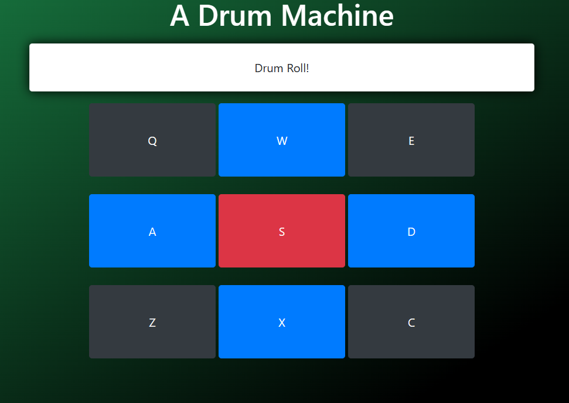

# drum_machine
App music  
Reproducción de sonidos de batería: La aplicación permite reproducir una variedad de sonidos de batería al hacer clic en los botones o al presionar las teclas correspondientes en el teclado. Cada botón está asociado a un archivo de audio que contiene el sonido de muestra de la batería. Al activar un botón o una tecla, se reproduce el sonido de la batería correspondiente.   

Interfaz interactiva: La aplicación proporciona una interfaz interactiva y visualmente atractiva. Los botones de la batería están dispuestos en la pantalla, y al hacer clic en ellos se activa el sonido correspondiente. Además, la retroalimentación en tiempo real se muestra en el elemento "display", que cambia según el botón o la tecla activada. Esto permite una experiencia de usuario más inmersiva y agradable.  

Compatibilidad con el teclado: Además de utilizar el ratón para hacer clic en los botones, la aplicación también permite la reproducción de sonidos de batería utilizando el teclado. Cada botón tiene asignada una tecla específica, por lo que los usuarios pueden tocar la batería utilizando su teclado en lugar de hacer clic en los botones. Esta funcionalidad facilita la reproducción de ritmos y la experimentación con diferentes combinaciones de sonidos.  
